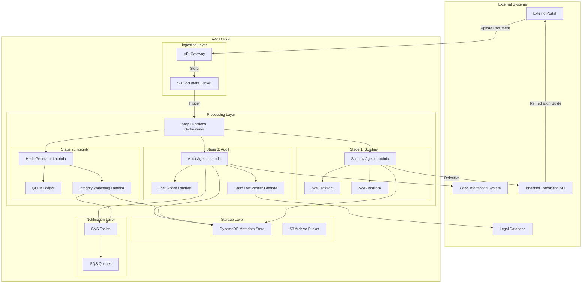

# Design Document: Nyaya-Dwarpal (Digital Scrutiny Officer)

## Overview

Nyaya-Dwarpal is an event-driven, serverless middleware system built on AWS that automates judicial document processing for Indian courts. The architecture follows a three-stage pipeline: (1) Automated Scrutiny for procedural validation, (2) Integrity Watchdog for tamper-proof storage, and (3) Substantive Audit for fact-checking and case law verification.

The system is designed as a collection of loosely-coupled AWS Lambda functions orchestrated by AWS Step Functions, with document storage in S3, metadata in DynamoDB, and cryptographic hashes in either DynamoDB with point-in-time recovery or AWS Quantum Ledger Database (QLDB) for immutability. Integration with external services (AWS Textract, Bedrock, Bhashini API, and CIS) is handled through asynchronous invocations with retry logic and circuit breakers.

Key design principles:
- Event-driven architecture for scalability and resilience
- Idempotent operations to handle retries safely
- Comprehensive error handling with dead-letter queues
- Audit logging for all operations
- Regional language support through Bhashini integration

## Architecture

### High-Level Architecture



### Component Interaction Flow

1. **Document Upload**: E-Filing Portal uploads document to API Gateway → S3
2. **Orchestration**: S3 event triggers Step Functions state machine
3. **Stage 1 - Scrutiny**: 
   - Extract text with Textract
   - Validate with Bedrock
   - Generate remediation guide if defective (via Bhashini)
4. **Stage 2 - Integrity**: 
   - Compute SHA-256 hash
   - Store in QLDB
   - Set up tampering detection
5. **Stage 3 - Audit**: 
   - Retrieve case records from CIS
   - Fact-check with Bedrock
   - Verify case law citations
   - Generate hearing-ready brief
6. **Notification**: Publish results to SNS topics for downstream systems

## Components and Interfaces

### 1. API Gateway and Document Ingestion

**Purpose**: Receive document uploads from E-Filing Portal and store in S3.

**Interface**:
```
POST /documents
Headers:
  - Authorization: Bearer <token>
  - Content-Type: multipart/form-data
Body:
  - file: <document binary>
  - caseNumber: string
  - documentType: string
  - filerInfo: JSON object
  - preferredLanguage: string (ISO 639-1 code)

Response:
  - 202 Accepted
  - documentId: string (UUID)
  - s3Location: string
```

**Implementation**:
- API Gateway validates authentication via AWS IAM or Cognito
- Lambda function extracts metadata and uploads to S3 with server-side encryption
- Returns document ID immediately (async processing)
- Publishes S3 event to trigger Step Functions

### 2. Scrutiny Agent Lambda

**Purpose**: Perform procedural validation using Textract and Bedrock.

**Input**:
```json
{
  "documentId": "uuid",
  "s3Bucket": "string",
  "s3Key": "string",
  "metadata": {
    "caseNumber": "string",
    "documentType": "string",
    "filerInfo": {},
    "preferredLanguage": "string"
  }
}
```

**Processing Logic**:
1. Invoke Textract `AnalyzeDocument` API with FORMS and TABLES features
2. Parse Textract response to extract:
   - Signature blocks (key-value pairs with "Signature" key)
   - Court fee payment references (search for fee receipt numbers)
   - Jurisdictional information (court name, location)
   - Annexure references (numbered attachments)
3. Construct validation prompt for Bedrock:
   ```
   Analyze this legal document for procedural compliance:
   - Are required signatures present? (List expected signatories)
   - Is court fee payment evidence included?
   - Does jurisdiction match the case type?
   - Are all mandatory annexures referenced?
   
   Document text: {extracted_text}
   Document structure: {textract_forms}
   ```
4. Invoke Bedrock (Claude 3 Sonnet) with validation prompt
5. Parse Bedrock response to determine compliance status
6. If defective, generate defect list

**Output**:
```json
{
  "documentId": "uuid",
  "status": "compliant" | "defective",
  "validationResults": {
    "signatures": {"present": boolean, "details": "string"},
    "courtFees": {"present": boolean, "details": "string"},
    "jurisdiction": {"valid": boolean, "details": "string"},
    "annexures": {"complete": boolean, "details": "string"}
  },
  "defects": ["string"],
  "extractedText": "string"
}
```

**Error Handling**:
- Textract failures: Retry 3 times with exponential backoff, then send to DLQ
- Bedrock throttling: Implement token bucket rate limiting
- Invalid document format: Return error to E-Filing Portal immediately

### 3. Remediation Guide Generator

**Purpose**: Create multilingual guidance for defective filings.

**Input**: Scrutiny Agent output with defects list

**Processing Logic**:
1. Generate remediation guide in English:
   ```
   Your filing has the following defects:
   
   1. [Defect description]
      How to fix: [Specific instructions]
   
   2. [Defect description]
      How to fix: [Specific instructions]
   
   Please correct these issues and refile.
   ```
2. Call Bhashini API for translation:
   ```
   POST https://bhashini.gov.in/api/v1/translate
   {
     "sourceLanguage": "en",
     "targetLanguage": "{preferredLanguage}",
     "text": "{remediation_guide}"
   }
   ```
3. If Bhashini fails, use English as fallback

**Output**: Translated remediation guide sent to E-Filing Portal via SNS

### 4. Hash Generator Lambda

**Purpose**: Compute cryptographic hash of validated documents.

**Input**: Document ID and S3 location

**Processing Logic**:
1. Download document from S3 (stream to avoid memory issues)
2. Compute SHA-256 hash:
   ```
   hash = SHA256(document_content + metadata_json)
   ```
3. Include metadata in hash: case number, document type, filing timestamp, filer ID
4. Return hash as hex string

**Output**:
```json
{
  "documentId": "uuid",
  "hash": "sha256_hex_string",
  "timestamp": "ISO8601",
  "metadata": {}
}
```

**Error Handling**:
- S3 download failure: Retry 3 times
- Hash computation error: Log and alert administrators

### 5. Integrity Watchdog Lambda

**Purpose**: Store hashes in immutable ledger and detect tampering.

**Storage in QLDB**:
```sql
CREATE TABLE DocumentHashes (
  documentId STRING,
  caseNumber STRING,
  hash STRING,
  filingTimestamp TIMESTAMP,
  filerInfo STRUCT,
  documentType STRING
)

INSERT INTO DocumentHashes VALUE {
  'documentId': ?,
  'caseNumber': ?,
  'hash': ?,
  'filingTimestamp': ?,
  'filerInfo': ?,
  'documentType': ?
}
```

**Tampering Detection**:
1. On document access, recompute hash
2. Query QLDB for original hash:
   ```sql
   SELECT hash FROM DocumentHashes WHERE documentId = ?
   ```
3. Compare hashes:
   ```
   if recomputed_hash != stored_hash:
     flag_tampering()
     send_alert()
     prevent_access()
   ```

**Output**: Ledger transaction ID and tampering detection status

### 6. Audit Agent Lambda

**Purpose**: Orchestrate substantive analysis of pleadings.

**Input**: Document ID, extracted text, case number

**Processing Logic**:
1. Retrieve related records from CIS:
   ```
   GET /cis/api/cases/{caseNumber}/firs
   GET /cis/api/cases/{caseNumber}/depositions
   ```
2. Invoke Fact Check Lambda with pleading text and case records
3. Invoke Case Law Verifier Lambda with pleading text
4. Aggregate results and generate hearing-ready brief
5. Calculate trial readiness score:
   ```
   score = (procedural_compliance * 0.4) + 
           (factual_consistency * 0.3) + 
           (case_law_validity * 0.3)
   ```

**Output**: Hearing-ready brief with prioritization score

### 7. Fact Check Lambda

**Purpose**: Detect factual contradictions using Bedrock.

**Input**: Pleading text and case records (FIRs, depositions)

**Processing Logic**:
1. Construct fact-checking prompt:
   ```
   Compare the following pleading against existing case records.
   Identify any factual contradictions.
   
   Pleading: {pleading_text}
   
   Existing FIR: {fir_text}
   
   Existing Depositions: {deposition_texts}
   
   For each contradiction, provide:
   - The contradictory statement in the pleading
   - The conflicting statement in the case record
   - The source document reference
   ```
2. Invoke Bedrock with prompt
3. Parse response to extract contradictions

**Output**:
```json
{
  "contradictions": [
    {
      "pleadingStatement": "string",
      "conflictingStatement": "string",
      "sourceDocument": "string",
      "severity": "high" | "medium" | "low"
    }
  ],
  "consistencyScore": 0.0-1.0
}
```

### 8. Case Law Verifier Lambda

**Purpose**: Verify cited case laws against legal databases.

**Input**: Pleading text

**Processing Logic**:
1. Extract case law citations using regex patterns:
   ```
   patterns = [
     r'\d{4}\s+\w+\s+\d+',  # 2023 SCC 123
     r'AIR\s+\d{4}\s+\w+\s+\d+',  # AIR 2023 SC 456
     r'\[\d{4}\]\s+\d+\s+SCC\s+\d+'  # [2023] 5 SCC 789
   ]
   ```
2. For each citation, query legal database:
   ```
   GET /legal-db/api/cases?citation={citation}
   ```
3. Verify citation exists and extract case summary
4. Use Bedrock to assess relevance:
   ```
   Is the following case citation relevant to the legal argument?
   
   Legal argument: {argument_context}
   Case citation: {citation}
   Case summary: {case_summary}
   
   Respond with: Relevant | Not Relevant | Unclear
   ```

**Output**:
```json
{
  "citations": [
    {
      "citation": "string",
      "verified": boolean,
      "relevant": "Relevant" | "Not Relevant" | "Unclear",
      "caseSummary": "string"
    }
  ],
  "verificationScore": 0.0-1.0
}
```

### 9. Step Functions Orchestrator

**Purpose**: Coordinate the three-stage pipeline with error handling.

**State Machine Definition**:
```json
{
  "StartAt": "ScrutinyStage",
  "States": {
    "ScrutinyStage": {
      "Type": "Task",
      "Resource": "arn:aws:lambda:scrutiny-agent",
      "Retry": [
        {
          "ErrorEquals": ["States.TaskFailed"],
          "IntervalSeconds": 2,
          "MaxAttempts": 3,
          "BackoffRate": 2.0
        }
      ],
      "Catch": [
        {
          "ErrorEquals": ["States.ALL"],
          "Next": "ScrutinyFailed"
        }
      ],
      "Next": "CheckCompliance"
    },
    "CheckCompliance": {
      "Type": "Choice",
      "Choices": [
        {
          "Variable": "$.status",
          "StringEquals": "defective",
          "Next": "GenerateRemediation"
        }
      ],
      "Default": "IntegrityStage"
    },
    "GenerateRemediation": {
      "Type": "Task",
      "Resource": "arn:aws:lambda:remediation-generator",
      "End": true
    },
    "IntegrityStage": {
      "Type": "Parallel",
      "Branches": [
        {
          "StartAt": "GenerateHash",
          "States": {
            "GenerateHash": {
              "Type": "Task",
              "Resource": "arn:aws:lambda:hash-generator",
              "End": true
            }
          }
        },
        {
          "StartAt": "StoreInLedger",
          "States": {
            "StoreInLedger": {
              "Type": "Task",
              "Resource": "arn:aws:lambda:integrity-watchdog",
              "End": true
            }
          }
        }
      ],
      "Next": "AuditStage"
    },
    "AuditStage": {
      "Type": "Task",
      "Resource": "arn:aws:lambda:audit-agent",
      "Next": "GenerateBrief"
    },
    "GenerateBrief": {
      "Type": "Task",
      "Resource": "arn:aws:lambda:brief-generator",
      "End": true
    },
    "ScrutinyFailed": {
      "Type": "Fail",
      "Error": "ScrutinyError",
      "Cause": "Document scrutiny failed after retries"
    }
  }
}
```

## Data Models

### Document Metadata (DynamoDB)

```json
{
  "documentId": "uuid (partition key)",
  "caseNumber": "string (GSI partition key)",
  "documentType": "string",
  "filingTimestamp": "ISO8601 (GSI sort key)",
  "filerInfo": {
    "filerId": "string",
    "filerName": "string",
    "filerType": "advocate" | "party" | "government"
  },
  "s3Location": {
    "bucket": "string",
    "key": "string"
  },
  "status": "pending" | "compliant" | "defective" | "archived",
  "scrutinyResults": {
    "signatures": {},
    "courtFees": {},
    "jurisdiction": {},
    "annexures": {}
  },
  "defects": ["string"],
  "hash": "string",
  "ledgerTransactionId": "string",
  "auditResults": {
    "contradictions": [],
    "caseVerifications": [],
    "trialReadinessScore": 0.0-1.0
  },
  "preferredLanguage": "string",
  "createdAt": "ISO8601",
  "updatedAt": "ISO8601",
  "ttl": "number (for automatic archival)"
}
```

**Indexes**:
- Primary: `documentId`
- GSI: `caseNumber` + `filingTimestamp` (for case-based queries)
- GSI: `status` + `filingTimestamp` (for status-based queries)

### Document Hash Record (QLDB)

```json
{
  "documentId": "uuid",
  "caseNumber": "string",
  "hash": "string",
  "filingTimestamp": "ISO8601",
  "filerInfo": {
    "filerId": "string",
    "filerName": "string"
  },
  "documentType": "string",
  "metadata": {
    "fileSize": "number",
    "mimeType": "string"
  }
}
```

**QLDB Features**:
- Immutable append-only journal
- Cryptographically verifiable history
- Built-in SHA-256 document verification

### Hearing-Ready Brief

```json
{
  "briefId": "uuid",
  "caseNumber": "string",
  "documentId": "uuid",
  "generatedAt": "ISO8601",
  "proceduralStatus": {
    "compliant": boolean,
    "defects": ["string"]
  },
  "substantiveAnalysis": {
    "contradictions": [
      {
        "pleadingStatement": "string",
        "conflictingStatement": "string",
        "sourceDocument": "string",
        "severity": "string"
      }
    ],
    "caseVerifications": [
      {
        "citation": "string",
        "verified": boolean,
        "relevant": "string"
      }
    ]
  },
  "trialReadinessScore": 0.0-1.0,
  "priorityRank": "number",
  "recommendations": ["string"]
}
```

## Error Handling

### Error Categories and Strategies

1. **Transient Errors** (Network timeouts, service throttling):
   - Strategy: Exponential backoff retry (3 attempts)
   - Implementation: Step Functions retry configuration
   - Example: Textract throttling → wait 2s, 4s, 8s

2. **Permanent Errors** (Invalid document format, authentication failure):
   - Strategy: Immediate failure, send to DLQ
   - Implementation: Catch block in Step Functions
   - Notification: SNS alert to administrators

3. **External Service Failures** (Bhashini unavailable, CIS timeout):
   - Strategy: Graceful degradation
   - Implementation: Fallback to English for Bhashini, skip substantive audit for CIS
   - Logging: Record service unavailability for monitoring

4. **Data Integrity Errors** (Hash mismatch, ledger write failure):
   - Strategy: Critical alert, halt processing
   - Implementation: SNS high-priority alert, mark document for manual review
   - Recovery: Manual administrator intervention required

### Dead Letter Queue (DLQ) Processing

- All Lambda functions have associated DLQs (SQS)
- DLQ messages retained for 14 days
- Automated retry after 1 hour for transient errors
- Manual review dashboard for permanent errors

### Circuit Breaker Pattern

For external service calls (Bhashini, CIS, Legal DB):
```
if failure_rate > 50% over 5 minutes:
  open_circuit()
  return_fallback_response()
  
after 30 seconds:
  attempt_half_open()
  if success:
    close_circuit()
  else:
    reopen_circuit()
```

### Logging and Monitoring

- CloudWatch Logs for all Lambda executions
- CloudWatch Metrics:
  - Document processing latency (p50, p95, p99)
  - Scrutiny pass/fail rates
  - Tampering detection events
  - External service error rates
- X-Ray tracing for end-to-end request tracking
- CloudWatch Alarms:
  - Error rate > 5%
  - Processing latency > 20 minutes
  - QLDB write failures
  - Tampering detection events


## Correctness Properties

A property is a characteristic or behavior that should hold true across all valid executions of a system—essentially, a formal statement about what the system should do. Properties serve as the bridge between human-readable specifications and machine-verifiable correctness guarantees.

### Property 1: Valid File Format Acceptance

*For any* uploaded file, the system should accept it if and only if its format is PDF, JPEG, PNG, or TIFF, and reject all other formats with an appropriate error message.

**Validates: Requirements 1.1**

### Property 2: Metadata Extraction Completeness

*For any* successfully ingested document, the extracted metadata should contain all required fields: case number, filing date, document type, and filer information.

**Validates: Requirements 1.2**

### Property 3: Error Notification on Extraction Failure

*For any* document where extraction fails, the system should log the error and send a notification to the E_Filing_Portal containing a descriptive error message.

**Validates: Requirements 1.3**

### Property 4: Scrutiny Agent Triggering

*For any* document that is successfully ingested, the Scrutiny_Agent should be triggered for validation.

**Validates: Requirements 1.4**

### Property 5: Comprehensive Procedural Validation

*For any* document received by the Scrutiny_Agent, all four validation checks (signatures, court fees, jurisdiction, annexures) should be performed, and the document should be marked compliant if and only if all checks pass.

**Validates: Requirements 2.2, 2.3, 2.4, 2.5, 2.6, 2.7**

### Property 6: Defect Identification Completeness

*For any* document marked as defective, the system should identify and list all specific defects that caused the validation failure.

**Validates: Requirements 2.7**

### Property 7: Remediation Guide Generation

*For any* defective document, a Remediation_Guide should be generated that lists all identified defects with specific correction instructions for each defect.

**Validates: Requirements 3.1, 3.2**

### Property 8: Translation and Delivery

*For any* generated Remediation_Guide, the system should attempt translation to the filer's preferred language via Bhashini and deliver the guide (translated or English fallback) to the E_Filing_Portal.

**Validates: Requirements 3.3, 3.4**

### Property 9: Hash Generation for Compliant Documents

*For any* document that passes procedural validation, a SHA-256 hash should be computed that includes both the document content and its metadata.

**Validates: Requirements 4.1, 4.2**

### Property 10: Metadata Changes Affect Hash

*For any* document, if the metadata is modified while content remains the same, the computed hash should be different from the original hash.

**Validates: Requirements 4.2**

### Property 11: Hash Record Completeness

*For any* generated document hash, the hash record should include the case number, filing timestamp, and all required metadata associations.

**Validates: Requirements 4.3**

### Property 12: Ledger Storage Guarantee

*For any* generated document hash, it should be stored in the Immutable_Ledger with a returned transaction ID as proof of storage.

**Validates: Requirements 5.1, 5.3**

### Property 13: Ledger Entry Completeness

*For any* hash stored in the ledger, the entry should contain case number, document type, filing timestamp, and filer information.

**Validates: Requirements 5.2**

### Property 14: Ledger Immutability

*For any* entry in the Immutable_Ledger, attempts to modify or delete it should fail, preserving the original entry unchanged.

**Validates: Requirements 5.5**

### Property 15: Tampering Detection via Hash Mismatch

*For any* document, if its content or metadata is modified after the original hash is stored, recomputing the hash should produce a different value, triggering a tampering flag.

**Validates: Requirements 6.1, 6.2**

### Property 16: Tampering Alert and Logging

*For any* detected tampering event, the system should generate a real-time alert to administrators and log the event with timestamp, user identity, and hash mismatch details.

**Validates: Requirements 6.3, 6.4**

### Property 17: Tampered Document Access Prevention

*For any* document flagged as tampered, the system should prevent its use in judicial proceedings until manually reviewed.

**Validates: Requirements 6.5**

### Property 18: CIS Retrieval for Audit

*For any* document that passes procedural validation, the Audit_Agent should attempt to retrieve related FIRs and depositions from the CIS.

**Validates: Requirements 7.1**

### Property 19: Contradiction Flagging with References

*For any* detected factual contradiction, the flagged contradiction should include the contradictory statement, the conflicting statement, and a reference to the source document.

**Validates: Requirements 7.3**

### Property 20: Factual Consistency Marking

*For any* pleading where no contradictions are detected during analysis, the system should mark it as factually consistent.

**Validates: Requirements 7.4**

### Property 21: Case Law Citation Extraction

*For any* pleading analyzed by the Audit_Agent, all case law citations matching standard Indian legal citation formats should be extracted.

**Validates: Requirements 8.1**

### Property 22: Citation Verification Coverage

*For any* extracted case law citation, the system should query legal databases to verify its existence and flag it if verification fails.

**Validates: Requirements 8.2, 8.3**

### Property 23: Citation Relevance Assessment

*For any* verified case law citation, the system should assess and record its relevance to the legal argument being made.

**Validates: Requirements 8.4**

### Property 24: Verification Results in Brief

*For any* Hearing_Ready_Brief, it should include the verification results for all case law citations found in the pleading.

**Validates: Requirements 8.5**

### Property 25: Brief Generation Completeness

*For any* completed substantive analysis, a Hearing_Ready_Brief should be generated that includes procedural validation status, flagged contradictions with references, case law verification results, and a trial readiness score.

**Validates: Requirements 9.1, 9.2, 9.3, 9.4, 9.5**

### Property 26: Brief Delivery

*For any* completed Hearing_Ready_Brief, it should be delivered to the judicial case management system.

**Validates: Requirements 9.6**

### Property 27: Case Ranking by Readiness Score

*For any* set of multiple processed cases, they should be ranked in descending order by their trial readiness score, with higher scores indicating greater procedural cleanliness and factual consistency.

**Validates: Requirements 10.1, 10.2, 10.3, 10.4**

### Property 28: Ranked List Delivery

*For any* completed case prioritization, a ranked case list should be provided to the court scheduling system.

**Validates: Requirements 10.5**

### Property 29: Error Logging Completeness

*For any* error encountered by any component, an error log entry should be created containing timestamp, component name, and error details.

**Validates: Requirements 11.1**

### Property 30: Critical Error Alerting

*For any* critical error, an alert should be sent to system administrators.

**Validates: Requirements 11.2**

### Property 31: External Service Retry with Backoff

*For any* external service call (Textract, Bedrock, Bhashini, CIS) that fails due to service unavailability, the system should retry with exponential backoff.

**Validates: Requirements 11.3**

### Property 32: Manual Review on Retry Exhaustion

*For any* operation where retries are exhausted, the document should be marked for manual review and administrators should be notified.

**Validates: Requirements 11.4**

### Property 33: FIFO Queue Processing

*For any* set of documents submitted during high system load, they should be processed in the order they were submitted (FIFO ordering).

**Validates: Requirements 12.5**

### Property 34: Authentication Enforcement

*For any* request to the system, it should be rejected if valid AWS IAM credentials are not provided.

**Validates: Requirements 13.1**

### Property 35: Role-Based Access Control

*For any* document access attempt, it should succeed if and only if the requesting user's role has permission to access that document.

**Validates: Requirements 13.2**

### Property 36: Access Event Logging

*For any* document access by a user, an access log entry should be created containing user identity, timestamp, and document identifier.

**Validates: Requirements 13.3**

## Testing Strategy

### Dual Testing Approach

The Nyaya-Dwarpal system requires both unit testing and property-based testing to ensure comprehensive correctness:

**Unit Tests**: Focus on specific examples, edge cases, and integration points
- Example: Test that a specific defective document generates the expected remediation guide
- Example: Test that Bhashini translation failure triggers English fallback
- Example: Test that QLDB write failure after 3 retries triggers admin alert
- Edge cases: Empty documents, malformed PDFs, missing metadata fields
- Integration: Mock external services (Textract, Bedrock, Bhashini, CIS) to test error handling

**Property-Based Tests**: Verify universal properties across randomized inputs
- Generate random documents with varying formats, sizes, and metadata
- Generate random validation results (compliant/defective combinations)
- Generate random case records and pleadings to test contradiction detection
- Generate random case law citations (valid and invalid) to test verification
- Each property test should run minimum 100 iterations

### Property-Based Testing Framework

**Language**: Python (AWS Lambda runtime)
**Library**: Hypothesis (https://hypothesis.readthedocs.io/)

**Configuration**:
```python
from hypothesis import given, settings
import hypothesis.strategies as st

@settings(max_examples=100)
@given(document=st.documents())
def test_property_1_file_format_acceptance(document):
    """
    Feature: nyaya-dwarpal, Property 1: Valid File Format Acceptance
    For any uploaded file, the system should accept it if and only if 
    its format is PDF, JPEG, PNG, or TIFF
    """
    result = system.ingest_document(document)
    valid_formats = ['pdf', 'jpeg', 'jpg', 'png', 'tiff', 'tif']
    
    if document.format.lower() in valid_formats:
        assert result.status == 'accepted'
    else:
        assert result.status == 'rejected'
        assert 'format' in result.error_message.lower()
```

**Test Tagging Convention**:
Each property-based test must include a docstring with:
- Feature name: `nyaya-dwarpal`
- Property number and title from this design document
- Property statement

**Custom Generators**:
Create Hypothesis strategies for domain-specific data:
- `st.documents()`: Generate random documents with various formats
- `st.legal_metadata()`: Generate case numbers, filer info, document types
- `st.pleadings()`: Generate legal pleadings with case law citations
- `st.case_records()`: Generate FIRs and depositions
- `st.validation_results()`: Generate procedural validation outcomes

### Unit Testing Framework

**Language**: Python
**Library**: pytest

**Test Organization**:
```
tests/
├── unit/
│   ├── test_scrutiny_agent.py
│   ├── test_hash_generator.py
│   ├── test_integrity_watchdog.py
│   ├── test_audit_agent.py
│   └── test_remediation_generator.py
├── integration/
│   ├── test_step_functions_flow.py
│   ├── test_external_services.py
│   └── test_error_handling.py
└── property/
    ├── test_properties_ingestion.py
    ├── test_properties_validation.py
    ├── test_properties_integrity.py
    └── test_properties_audit.py
```

**Mocking Strategy**:
- Use `moto` library to mock AWS services (S3, DynamoDB, QLDB, Step Functions)
- Use `responses` library to mock external HTTP APIs (Bhashini, CIS, Legal DB)
- Mock Textract and Bedrock responses with realistic sample data

### Integration Testing

**End-to-End Flow Tests**:
1. Upload document → Verify scrutiny → Check hash storage → Validate audit
2. Defective document → Verify remediation guide generation and translation
3. Tampering simulation → Verify detection and alerting
4. CIS unavailability → Verify graceful degradation

**Performance Testing**:
- Load test with 100 concurrent documents
- Measure p50, p95, p99 latencies for each stage
- Verify auto-scaling behavior under load
- Test queue ordering under high load (Property 33)

### Test Coverage Goals

- Unit test coverage: >80% for all Lambda functions
- Property test coverage: All 36 properties implemented
- Integration test coverage: All critical paths and error scenarios
- Edge case coverage: All identified edge cases from prework

### Continuous Testing

**CI/CD Pipeline**:
1. On commit: Run unit tests and fast property tests (10 examples)
2. On PR: Run full property tests (100 examples) and integration tests
3. On deploy: Run smoke tests against staging environment
4. Nightly: Run extended property tests (1000 examples) and performance tests

**Test Monitoring**:
- Track property test failure rates
- Alert on new property violations
- Maintain test execution time budgets
- Monitor flaky test rates
